# Configuring an Azure Keyvault using the Azure Portal
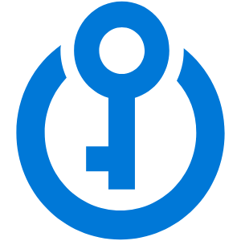


---------------------------------------------------------


## Requirements
- Microsoft Azure Account ( with funds or credits    )
- Microsoft Azure Suscription
- A web browser
- Access to internet
- Installed Azure Powershell or Azure CLI (optional)

---------------------------------------------------------

## Instructions
#### 1. Login to the [Azure Portal](https://portal.azure.com/).
#### 2. Once you're on the portal's home page, you will see something like this:

#### 3. Click on the searchbar at the top of the page and look for *Key vaults* and click on it.
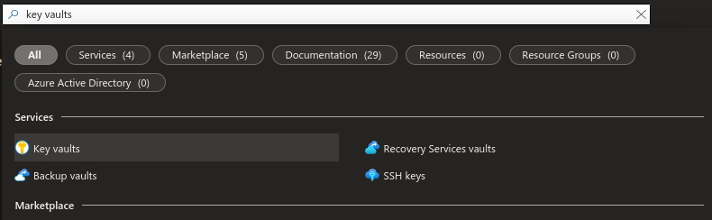
#### 4. Click *Create*.
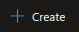
#### 5. Click on *Create* inside the *Core (SQL)* box.

#### 6. Select your subscription and a resource group. In my case, I'll be creating a new resource group.
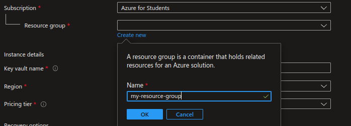
#### 7. Give your keyvault a name and select the region where it'll be located.
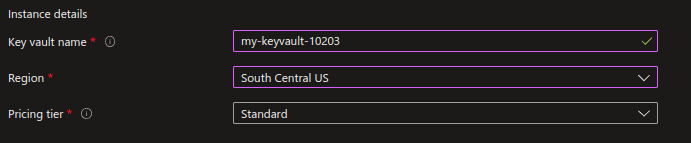
#### 8. If you want, you can further configure your resource. In my case I'll be leaving everything as default. When you're finished, click *Review + create*.

#### 9. If validation passed, click *Create*.

#### 10. Deployment will begin. Please wait a couple of seconds.
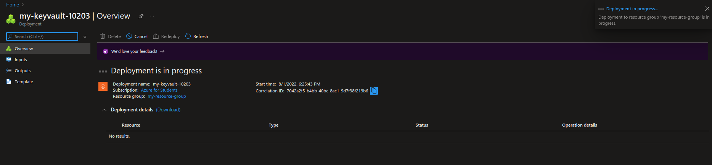
#### 11. Once deployment has completed, click on *Go to resource*.
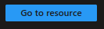
#### 12. Click on *Secrets*.
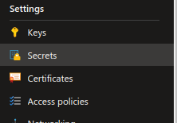
#### 13. Click on the *Generate / Import* button.
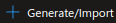
#### 14. Enter an identifier for the secret as well as the secret itself (strings of characters).
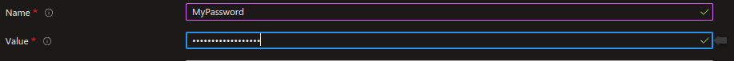
#### 15. Click *Create*.

#### 16. We will access your secret: first using the Azure Portal, and then on the command line. First, click on the secret you just created and then on the version, you should now be inside of a dashboard.
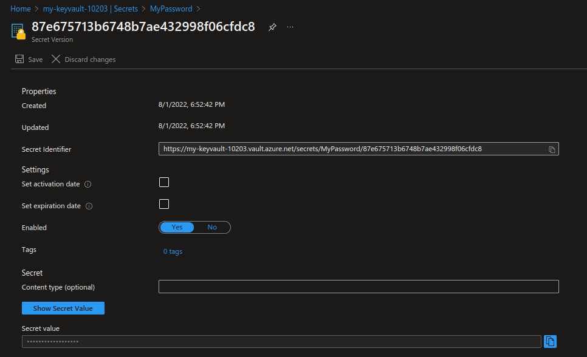
#### 17. In order to see your secret, just click on the *Show secret value*.
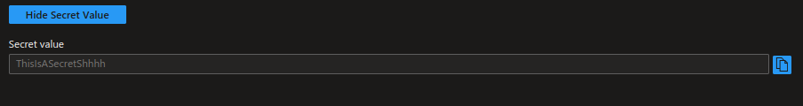
#### 18. We will now try to access it using Cloud Shell. First, click on the Cloud Shell icon at the top of the page.
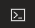
#### 19. If you haven't used Cloud Shell before, you will need to create a storage account. Just select your subscription and click *Create storage*.
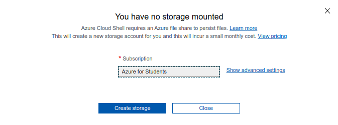
#### 20. To access the information inside the command line, copy the following setences, replacing the name and vault-name with the ones of the keyvault you created.
```Bash
az keyvault secret show --name (SecretName) -vault-name (KeyvaultName) --query value --output tsv
```
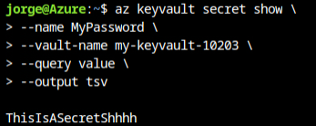
#### 21. If you have CLI or Azure Powershell installed on your system and have already logged in, you can also access your keyvault's content this way.
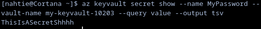

---------------------------------------------------------

## Congratulations ! You've just created and used an Azure Keyvault !
Don't forget to delete or turn off your resources when you you're done with them !
